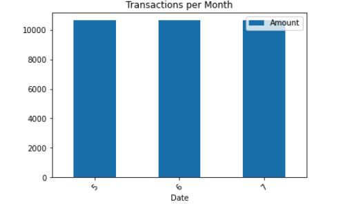

*******************************************************************************
# Budget Analysis: Summarize the transaction data from the budget analysis and include images for each chart and table produced.
*******************************************************************************
* Calculate the total spending per category and print the results

* Calulate the expenses per month

* Plot the total expenses per month

******************************************************************************
# Retirement Planning: Summarize the retirement portfolio analysis and include the charts for the Monte Carlo simulation.
*****************************************************************************

### Overview with charts

* Portfolio Cumulative returns - 30 years

* Probability distribution with confidence intervals - 20 and 30 years

### Retirement Analysis

* What are the expected cumulative returns at 30 years for the 10th, 50th, and 90th percentiles?

The expected cumulative returns at 30 years for the 10th, 50th, and 90th percentiles are:

 returns_10_percentile= 117.37594573549154 
 returns_50_percentile = 189.84383253943383
 returns_90_percentile = 314.34736073991616

* Given an initial investment of $20,000, what is the expected portfolio return in dollars at the 10th, 50th, and 90th percentiles?

The expected cumulative returns at 30 years for the 10th, 50th, and 90th percentiles are 117.37594573549154 and 189.84383253943383 and 314.34736073991616

* Given the current projected annual income from the Plaid analysis, will a 4% withdraw rate from the retirement portfolio meet or exceed that value at the 10th percentile?

Given the current projected annual income from the Plaid analysis, a 4% withdraw rate from the retirement portfolio will be 93900.75658839323 which is clearly higher than the projected_yearly_income_before_tax: 7389

* How would a 50% increase in the initial investment amount affect the 4% retirement withdrawal?

Given the current projected annual income from the Plaid analysis, a 4% withdraw rate from the retirement portfolio will be 140851.13488258986 which is clearly higher than the projected_yearly_income_before_tax:7389
